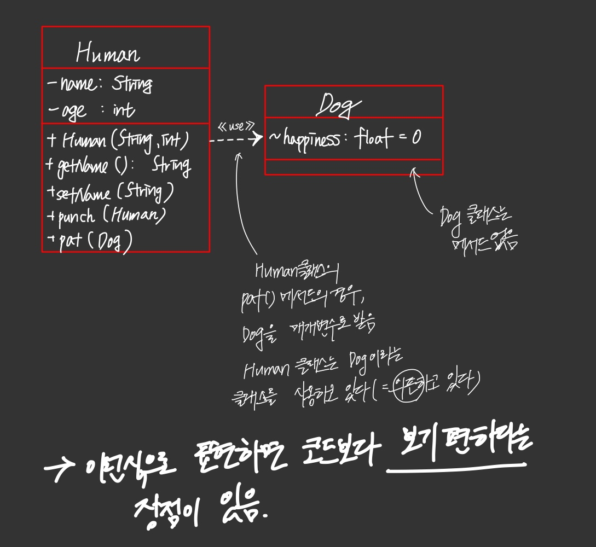

## 구조체의 한계

```c
// Data
struct Human
{
    int age;
    float height;
}
struct Dog
{
    int age;
    string name;
}
struct Cat
{
    int age;
    string name;
}
```

```c
// Method
void eat(Cat* cat)
{
    
}
void increaseAge(Dog* dog, int age)
{
    
}
void walk(Human* human)
{
    
}
```

struct 안에서는 함수를 정의할 수 없다. 단지 `데이터`만 정의할 수 있다. 이 struct 안의 데이터들을 조작하기 위해서는 메서드가 필요하니, 구조체 바깥에 함수들을 정의한다. 이로 인해 꽤나 불편한 점이 생기는데, 바로 어떤 구조체가 어떤 함수랑 연관있는지 찾기 복잡하다는 것이다. 즉 **데이터와 동작이 분리되어있어**, 데이터만 봤을 때 이 데이터에는 어떤 메서드를 사용할 수 있는지 한눈에 알기 어렵고, 함수만 봤을 때는 어떤 데이터로 이 함수가 돌아가는지를 한눈에 알기 어렵다는 점이다. 이러한 구조체의 한계를 깨고자 `클래스`가 탄생한 것이다. 즉 `구조체` + `동작` = `클래스`

## 개체 모델링

이미 사회에 존재하는 개념 또는 비즈니스 로직을 데이터와 동작으로 이루어진 클래스로 표현해보고, 이 클래스를 토대로 개체를 생성하여 서로 함수도 호출하고 데이터도 전달하는 설계를 하는 것이 개체 모델링이다.

실존하는 물체의 `상태`와 `동작`, 그리고 `물체간의 상호작용`을 만드는 것! 바로 클래스를 사용해서! 클래스는 어떤 물체의 명세이니까!

노트북을 만든다고 생각해보자.

어떻게 만들까?

클래스로 표현할 것이다.

```java
public class Laptop{
    
}
```

> 멤버변수로는 뭐가 필요할까? 노트북 모델명, 제조사, 제작 연도, CPU, RAM, 운영체제, 음 또,,, 스크린... 메서드로는 click(), on/off() 필요할거고... 아냐 생각의 전환을 해보자. 노트북도 조립을 한다고 생각하면 분명 각 부품마다 어떤 회사의 것을 샀는지 적어야 할 수도 있어 그렇다면 단순히 퉁쳐서 한번에 제조사를 적으면 안되고 해당 부품마다를 생각해줘야할듯...

위처럼 온갖 잡다한 생각이 든다. 멤버변수로 뭘 넣고 뭘 넣고... 그런데 개체지향 설계에 과연 정답이 있을까?

## 객체지향 설계에서 처음 맞닥트리는 난관

- **이렇다 할 정답이 없음**
- 사람처럼 생각하자는 것이 OOP
- 다시 말하는데 '사람다움'은 **주관적**
- 한 방에 제대로 설계하기가 어려움

철수 曰 '노트북은 그 자체가 하나의 개체지'
영희 曰 '노트북은 세 개체의 집합이지. 스크린, 키보드, 본체 이렇게 말이야'

#### 같은 노트북이라는 개체를 보더라도 사람마다 관점이 다르다.

따라서 지금부터 개체를 설계하는 다양한 방법을 봐보자. 이때 일일이 코드로 보는 것보다, `클래스 다이어그램`을 이용해 개체를 표현하면 훨씬 더 직관적으로 설계를 구조화하기 편하다.

## 클래스 다이어그램

- 어떤 시스템 안에 들어있는 **클래스들**을 보여줌
  - 클래스 안에는 상태, 동작, 접근 제어자가 있음
  - 클래스간의 관계(상속, 컴포지션 등)
- 시스템의 구조를 보여주기에 적합

### Dog 과 Human 클래스

```java
public class Dog{
    float happiness;
}

public class Human{
    private String name;
    private int age;
    
    public Human(String name, int age) {}
    public String getName() {}
    public void setName(String name) {}
    public void punch(Human enemy) {}
    public void pat(Dog dog) {}
}
```



## 오늘 만들 간단한 시스템 : 꽃에 물주기

- 화분에 꽃이 피어있음
- 이 꽃은 일정량의 물을 매일 뿌려만 주면 평생 살 수 있음
- 물을 뿌릴 때 사용하는 도구는 분무가
- 하루라도 일정량의 필요한 물을 못받으면 죽음
- 그 뒤 아무리 물을 뿌려도 안살아남

이 간단한 것을 만들 때도 고민할 것이 많음. 선택지도 많음.

화분과 분무기 중에, 분무기부터 모델링해보자.

## 모델링 1 - 분무기

1단계 : 분무기부터 모델링해보자

- 일단 클래스명을 정해야 함 -> waterSpray
- 가장 중요한 상태 : 현재 남아있는 물의 양
  - 처음 분무기가 생성될 때는 0
  - int remainingWaterInMl

|                          WaterSpray                          |
| :----------------------------------------------------------: |
|                -remainingWaterInMl : int = 0                 |
| + WaterSpray()<br />+getRemainingWater() : int<br />+setRemainingWater(int) |

- 생성자도 있어야 되겠지?
- 언제라도 남은 물의 양을 확인할 수 있었으면 좋겠으니 getter 추가
- 물이 떨어지면 다시 채워야 하니 setter 도 추가

```java
public void setRemainingWater(int amountInMl){
    this.remainingWaterInMl = amountInMl;
}
```

> 일단 아무 생각없이 setter 를 추가하긴 했다. 그런데, **물을 추가할 때 어떻게 생각하지?**

- 물을 200ml 까지 채워야지
- 물을 100ml 추가해야지

사람마다 물을 채운다는 것의 구체화된 행동의 생각이 다 다르다. 이것에 대한 정답은 없다. 주관적인 부분!

채운다는 개념으로 가면 setter 로 가면 일반적으로 사람들의 생각에 어느정도 들어맞음. 하지만 물을 추가한다는 개념으로 갈때 setter 로 간다면 조금 어색한 감이 없잖아 있음. 추가한다는 개념으로 갈 때는, addWater() 라는 메서드를 만들어주는 것이 더 적합한 것으로 보인다.

```java
public void addWater(int amountInMl){
    this.remainingWaterInMl += amounInMl;
}
```

- 원하면 setter 와 addWater 모두 추가해도 된다
- 근데 이번 모델링에서는 setter 를 버리도록 하겠다.

|                          WaterSpray                          |
| :----------------------------------------------------------: |
|                -remainingWaterInMl : int = 0                 |
| + WaterSpray()<br />+getRemainingWater() : int<br />+addWater(int) |

## 모델링 2 : 분무기 동작

분무기에 추가로 필요한 동작은 무엇일까?

물뿌리기!

- 메서드 이름은 무엇으로 할까?

- 역시 여러가지 선택지가 있음

  1. 동작에 초점을 맞출 경우

     - pull()
     - press()

  2. 용도에 초점을 맞출 경우

     - spray() ⬅ 나의 선택

     ```java
     public void spray(){
         this.remainingWaterInMl -= Math.min(this.remainingWaterInMl, 5);
     }
     ```

### `void spray()` vs `int spray()` ?

1. 분무한 양을 반환하지 않더라도 확인 가능

   ```java
   int beforeMl = waterSpray.getRemainingWater();
   waterSpray.spray();
   int sprayedMl = beforeMl = waterSpray.getRemainingWater();
   ```

2. 직접 반환하게 만들 수도 있음

   ```java
   public int spray(){
       int sprayedMl = Math.min(this.remainingWaterInMl, 5);
       this.remainingWaterInMl -= sprayedMl;
       return sprayedMl;
   }
   ```

   

## 정답은 없음! BUT...

- 두번째 방법에는 약간의 문제가 있음

- **바로 메서드 시그내쳐 만으로 정확히 뭘 반환했는지 알기 힘들다**는 것임

- 뿌린 물의 양을 반환하는지..? 뿌리고 남은 물의 양을 반환하는지..?

- 메서드가 하는 일이 너무 많다고 볼 수도 있음(물뿌리고, 남은 물도 반환해주고.. 근데 이건 주관적)

  - 뭐든지 명백한 게 좋으니 `void spray()` 가 좀 더 좋다고 생각

  - 두번쨰 방법도 흔히 사용하는 패턴이니 정 필요하면 그래도 됨

    -  메서드 이름을 좀 더 명확하게 하는 것도 방법

      ```java
      int sprayAndGetUsedAmount() {...}
      ```

spray() 는 변동 없이 그대로 가겠다!

|                          WaterSpray                          |
| :----------------------------------------------------------: |
|                -remainingWaterInMl : int = 0                 |
| + WaterSpray()<br />+getRemainingWater() : int<br />+addWater(int)<br />+spray() |

근데, 분무기도 다양하잖아? 색상도, 모양도, 제조사도 다 다름...

맞음. 이런것도 반영하면 클래스가 아래처럼 바뀜

|                          WaterSpray                          |
| :----------------------------------------------------------: |
| -remainingWaterInMl : int = 0<br />**-color: Color<br />-brand: String<br />-shape: Shape** |
| + WaterSpray()<br />+getRemainingWater() : int<br />**+getColor(): Color<br />+getBrand(): String<br />+getShape(): Shape<br />**+addWater(int)<br />+spray() |

### 그런데, 이게 반드시 필요한 정보인가?

## 개체 모델링에서 흔히 저지르는 실수

- 실세계의 상태와 동작을 모두 클래스에 넣으려고 함
- 사용하지도 않는 멤버변수, 메서드가 있다면?
  - 그래도 계속 고치고 테스트 해야함
- 즉 쓸데없는 유지보수 비용 증가

## 완벽한 코드는 없음

- 처음부터 올바르게 모델링할수 있다는 망상을 버리자
- 코드는 필요한 시점에 추가하자

고로, 단순하게 가자!

|                          WaterSpray                          |
| :----------------------------------------------------------: |
|                -remainingWaterInMl : int = 0                 |
| + WaterSpray()<br />+getRemainingWater() : int<br />+addWater(int)<br />+spray() |

## 모델링 3: 분무기 최대 용량 제한

- 지금까지 설계한 클래스에는 최대용량 제한이 없음

- 즉, addWater() 를 계속 호출하면 끝도 없이 물이 채워짐

- 두가지 방법이 있음

  1. 모든 분무기의 용량이 같은 경우

     ```java
     public class WaterSpray{
         private static final int CAPACITY = 200; // 매직 넘버를 쓸 수도 있지만 상수형 변수가 더 좋은 습관
         ...
         public void addWater(int amountInMl){
             this.remainingWaterInMl += amountInMl;
             this.remainingWaterInMl = Math.min(this.remainingWaterInMl, CAPACITY);
         }
     }
     ```

  2. 분무기마다 최대 용량이 달라질 수 있는 경우

     - 최대 용량을 생성자에서 초기화
     - 최대 용량을 멤버변수로

     |                          WaterSpray                          |
     | :----------------------------------------------------------: |
     |    **-capacity: int**<br />-remainingWaterInMl : int = 0     |
     | **+ WaterSpray(int)**<br />**+getCapacity(): int**<br />+getRemainingWater() : int<br />+addWater(int)<br />+spray() |

## 최대 용량이 있으니, 또 다른 동작을 생각해보자

> 총 용량이 200ml인 분무기 통에 물이 반쯤 차있다. 여기에 물을 추가할 때 어떻게 생각하는가?

`100ml 더 추가해야지` vs `가득 채워야지`

나는 `가득 채워야지` 로 가겠다.

## '가득 채워야겠다' 동작 추가하기

- `capacity` 란 상태가 있으니 충분히 해당 동작을 추가 가능

- 가득 채운다는 의미에서 이름은 fillUp()으로

  ```java
  public class WaterSpray(){
      ...
      public void fillUp(){
          this.remainingWaterInMl = CAPACITY;
      }
  }
  ```

  |                          WaterSpray                          |
  | :----------------------------------------------------------: |
  |                -remainingWaterInMl : int = 0                 |
  | + WaterSpray()<br />+getRemainingWater() : int<br />+addWater(int)<br />+spray()<br />+fillUp() |

이렇듯 상태를 추가하면 새로운 메서드가 필요한 경우가 생긴다. 필요한 상태만 추가하는게 좋은 또 다른 이유!


